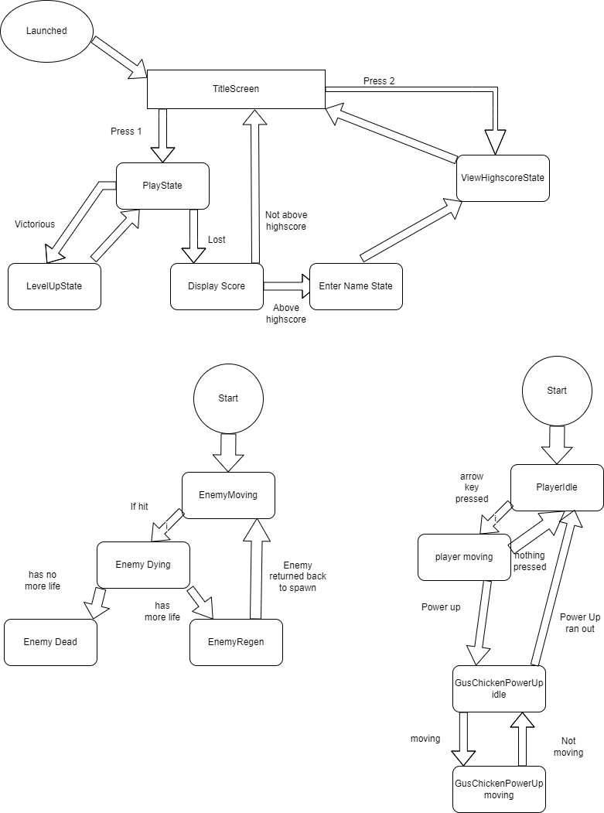
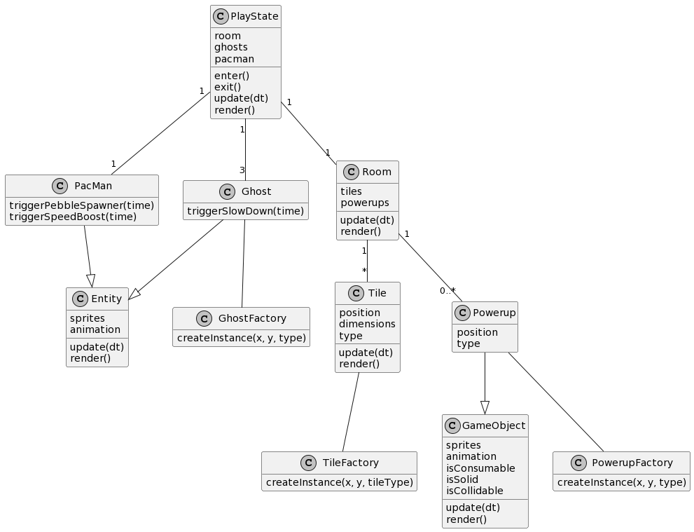
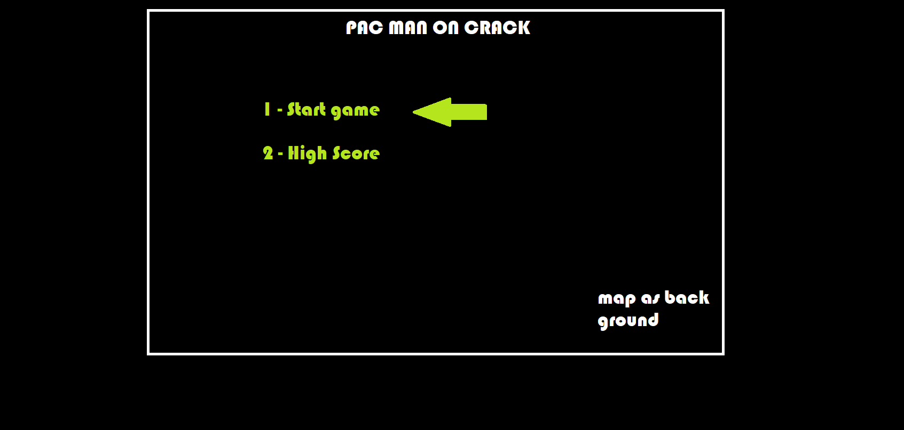
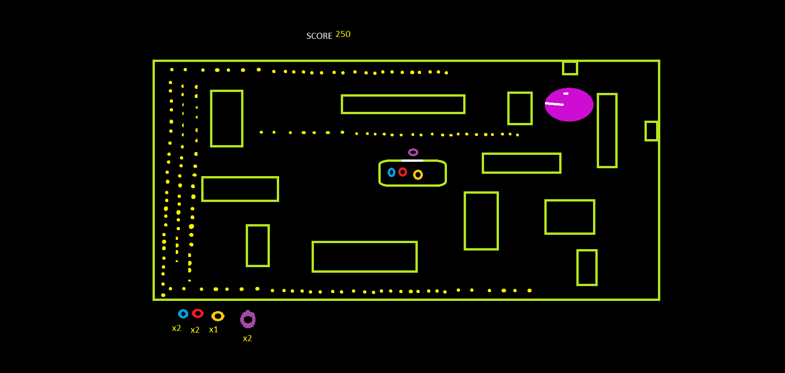
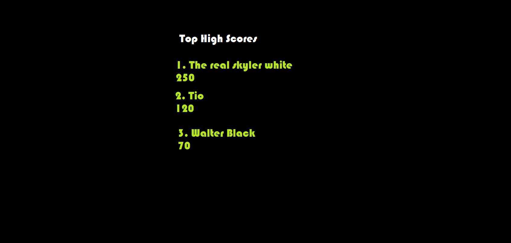

# Game Programming Project - Pac Man on Crack 🌶 🍗 🥶 

## ✒️ Description

This isn't any ordinary pac man game. See our friend Mr. Pac Man has some bad friends and got mixed up with that Walter White stuff. The goal of the game is to kill the ghost before before they collect all the pebbles and cure you from your addiction. There will be multiple power-ups to aid you in your quest to kill . In order to win you must kill a ghost three times before that ghost is out, as the levels progress the number of ghosts will increase.
You lose if the ghost collect all the pebbles. You get scored based off of how many ghosts you kill.

## 🕹️ Gameplay

The game starts off with Mr. Pac Man on the top left of top left of the map, while the ghost will spawn in the middle of the map. You must kill each ghost 3 times in order to win. You lose if the ghost collect all the pebbles. As you progress the levels the numbers of ghost will increase.

There are 3 main power ups that will help you kill the ghosts.

- Walter's Cook
    This will slow down the ghost for a short period of time.
- Jesse's Chilli P
    This will increase Pac Man's speed for a short period of time.
- Gus Chicken 
    This will drop pebbles behind you for the ghost to collect for a short period of time.

Controlls : Arrow Keys
Up:    "^"
Down:  "v"
Left:  "<"
right: ">"

## 📃 Requirements

1. User is greeted with the Welcome screen. 
2. Then shown the title screen where they can press enter on one of 2 options -> Start Or View high scores.
3. OPTIONS A High score -> Browser local storage and display the high scores. Press a button then goes back to the title screen. 
4. OPTIONS B Start -> Goes starts the game.
5. From playstate. Check Victory and Check Loss.
6. If victorious change level increase number of ghosts.
7. If lost check if the high score was beaten if so go to let user input name for the high score else display the score and go back to title screen.    
8. Walter's Cook will randomly spawn in the game. This ability slow down all ghosts for a short period of time (Consumable object).
9. Jesse's Chili P will randomly spawn in the game. This ability will increase Pac Man's (local player) speed for a short period of time (Consumable object).
10. Gus Chicken will randomly spawn in the game. This ability will drop pebbles behind Pac Man (local player) for the enemy ghosts to pickup.
11. Ghosts pickup the pebbles.
12. When a player hits a ghost, they will get sent back to thier spawnpoint (ghost position will be tweened).

### 🤖 State Diagram

### 🗺️ Class Diagram

### 🧵 Wireframes

Here is the main menu. We want to have the map as the background with Pac man chasing the ghosts around. Here the user can select the main menu or the high score.

We want to make auto generated maps but also keep it similar to the layout of pac man. We are still debating on the characters images, but it is similar to what we want to have.

We want a simple GUI and have something basic as demonstrated.  

### 🎨 Assets

We used paint to create the wireframes. The Wire frames are templates that we want to follow when creating our game.

We plan on following same layout as pac man as well as having some references to breaking bad.

#### 🖼️ Images
We will be using an image from this website to create our maps
https://fernandoruizrico.com/phaser-unit-4/ and we will use Tiled.

We will be using some sprites from theses websties 

- Pac man: https://tcrf.net/Pac-Man_%28Arcade%29 

- Walts Cook, Chilli P: https://www.reddit.com/r/bindingofisaac/comments/vbxk46/flip_has_flopped_welcome_to_round_29_of_quality_4/

- Gus's Chicken: https://www.vecteezy.com/vector-art/24604182-cartoon-fried-chicken-illustration-suitable-for-pattern-food-packaging-or-anything-fast-food-restaurant 

#### 🔊 Sounds

All sounds were taken from [freesound.org](https://freesound.org).

- Lost: https://freesound.org/people/AdamWeeden/sounds/157218/
- Pickup: https://freesound.org/people/timgormly/sounds/170170/
- Alternative pickup: https://freesound.org/people/vero.marengere/sounds/450344/ 
- Gameplay music: https://www.youtube.com/watch?v=pYAGlaZGwBA 

